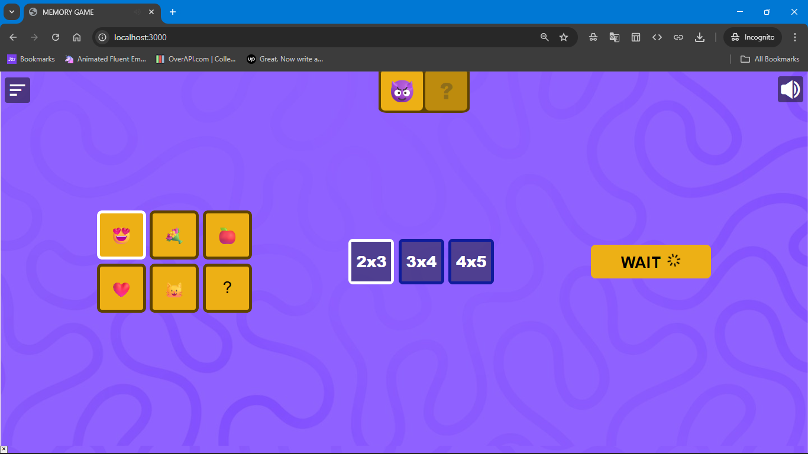
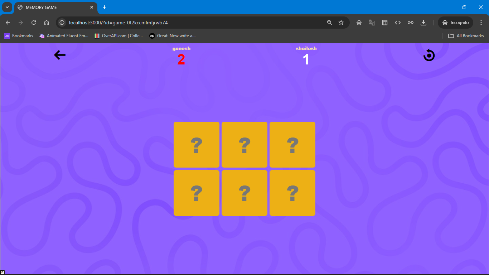

# 🎮 Memory Game

A fun and interactive multiplayer memory card game built with **Node.js**, **Socket.IO**, and **Vanilla JavaScript**.  
Players can join a game, flip cards, and compete to match pairs. The game updates in real-time using WebSockets.

---

## 🚀 Features

- 🔥 **Real-Time Gameplay** – Players see updates instantly with Socket.IO.  
- 👥 **Multiplayer Support** – Two players can compete in the same room.  
- 🃏 **Customizable Board Size** – Choose different grid sizes for varied difficulty.  
- 🔐 **Unique Game IDs** – Shareable game links for easy joining.  
- 🔄 **Dynamic Game State** – Server manages all game logic and syncing.  
- 🎨 **Clean UI** – Simple and user-friendly interface with animations.  

---

## 🛠️ Tech Stack

| Technology      | Purpose                          |
|-----------------|---------------------------------|
| Node.js         | Backend server                  |
| Express.js      | Web server and routing          |
| Socket.IO       | Real-time communication         |
| TypeScript      | Type safety for backend code    |
| HTML/CSS/JS     | Frontend                        |

---

## 📂 Project Structure

```plaintext
memory-game/
├── public/                # Static frontend files
│   ├── index.html         # Home screen
│   ├── game.html          # Game screen
│   ├── styles.css         # Styles
│   └── client.js          # Client-side JS
├── src/
│   ├── server.ts          # Express server setup
│   ├── socketManager.ts   # Socket.IO event handling
│   ├── gameManager.ts     # Game logic and state
│   └── utils/             # Helper functions
├── package.json
└── README.md
````

---

## ⚙️ Installation & Setup

1. **Clone the Repository**

   ```bash
   git clone https://github.com/shailesh-04/memory-game.git
   cd memory-game
   ```

2. **Install Dependencies**

   ```bash
   npm install
   ```

3. **Run the Server**

   ```bash
   npm run dev
   ```

   The app will start at `http://localhost:3000`.

---

## 🎯 How to Play

1. Open the home page and start a new game.
2. Share the game link (with the unique ID) with your friend.
3. Players take turns flipping two cards at a time.
4. Match all pairs to win the game!

---

## 🔑 Core Concepts

* **Game State Management**
  The backend manages all cards, scores, and turns. Clients only render updates.

* **Real-Time Communication**
  Socket.IO sends events like `matchmaking:response`, `card:flip`, and `update:state` for smooth multiplayer interactions.

---

## 🖼️ Screenshots

| Home Screen                   | Game Board                    |
| ----------------------------- | ----------------------------- |
|  |  |

---

## 🛡️ Future Improvements

* ✅ Add AI mode for single-player practice.
* ✅ Add difficulty levels (easy, medium, hard).
* ✅ Improve animations and card flipping effects.
* ✅ Add leaderboard and user authentication.

---

## 🤝 Contributing

Contributions are welcome!

1. Fork the repository.
2. Create a new branch (`feature/your-feature`).
3. Commit your changes and submit a pull request.

---

## 📜 License

This project is licensed under the **MIT License**.
Feel free to use, modify, and distribute it.

---

👨‍💻 Developed with ❤️ by [shailesh makavana](https://github.com/shailesh-04)

```
